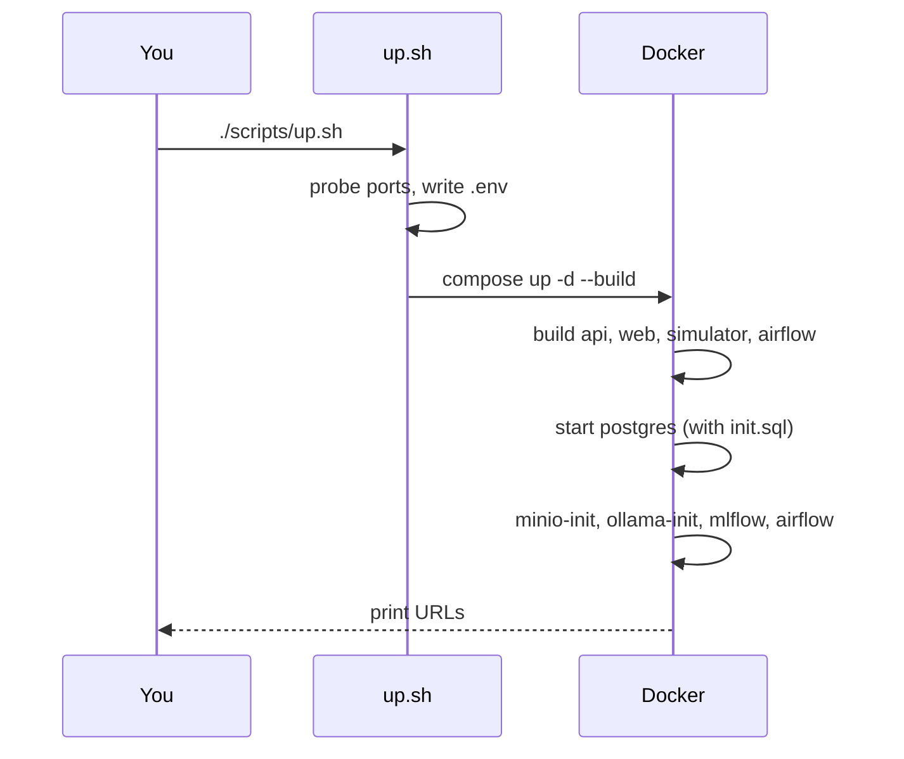

# Tutorial 01 — Getting started

You will launch phase 2, seed initial data, and open the React UI.

## Prerequisites

- Phase 1 already running (`cd .. && ./scripts/up.sh`).
- Docker 24+ with Compose v2.

## 1. Launch

```bash
cd local-demo/ai
./scripts/up.sh
```

`up.sh` auto-wires host ports, writes `.env`, warns if phase 1 isn't
running, then `docker compose up -d --build`.

First build pulls: Ollama image (~2 GB later pulls the model), MLflow,
Airflow, and builds the React + FastAPI images. Allow 5–10 min.



## 2. Seed

```bash
./scripts/seed.sh
```

Triggers `profile_etl`, `anomaly_detect`, and `daily_hotspot_report` once
so the feature tables have data immediately.

## 3. Open

```bash
source .env
echo "Web:     http://localhost:$WEB_PORT"
echo "API:     http://localhost:$API_PORT/docs"
echo "Airflow: http://localhost:$AIRFLOW_PORT  (admin/admin)"
```

Web UI → **Hotspots** should show rows within a minute.

## 4. Inject an incident

```bash
./scripts/simulate-incident.sh blocker
```

This drives `/blocking/on-eventloop` on phase-1 demo-jvm11 for ~2 min and
writes an `incidents` row (with a random-but-valid fingerprint). After the
next `regression_detect` cycle (top of the hour, or trigger manually), a
regression row with LLM summary will appear in the UI.

## Next

- [Your first regression](02-your-first-regression.md)
- [Chat with profiles](03-chat-with-profiles.md)
