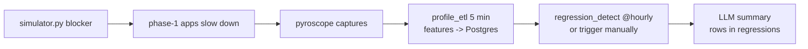

# Tutorial 02 — Your first regression

Inject a deliberate performance regression, let the DAGs detect it, read the
LLM summary.

## 1. Baseline

Make sure phase-1 load is running (`cd .. && ./scripts/load.sh &`) and
phase-2's simulator is NOT running — you want a clean baseline for 5+ min.

## 2. Trigger a "deploy boundary"

```bash
# hammer the event-loop blocker for 2 min (simulator tags it as an incident)
./scripts/simulate-incident.sh blocker
```

Behind the scenes the simulator:

1. Records a row in `incidents` (kind=`blocker`, service=`demo-jvm11`).
2. Drives high-latency traffic against `/blocking/on-eventloop`.
3. End-of-window writes the incident's end_ts.

## 3. Let the pipeline run

Two DAGs process this:



Trigger manually instead of waiting an hour:

```bash
docker compose exec -T airflow airflow dags trigger regression_detect
```

## 4. Read the result

Open Web UI → **Regression**. You should see:
- Before / after flame graphs.
- A delta table (functions sorted by `|rel|`; red = grew, green = shrank).
- At the bottom, the most recent LLM summary.

The summary is generated by whichever LLM you set (`LLM_PROVIDER` in `.env`).
Default is Ollama `llama3.2:3b` — good enough for this demo; try Claude or
GPT for higher-quality summaries.

## 5. Inspect in Grafana

Phase-1 Grafana → Dashboards → "AI Incidents & Regressions (phase 2)".
The SQL panels show the same `regressions` and `incidents` rows that the
React UI reads.

## What you learned

- DAGs run on a schedule but can be triggered at will.
- Detection is windowed diff + threshold; LLM adds a human summary, not
  a decision.
- The same data is available in two UIs (React + Grafana) via one source
  of truth (Postgres).
