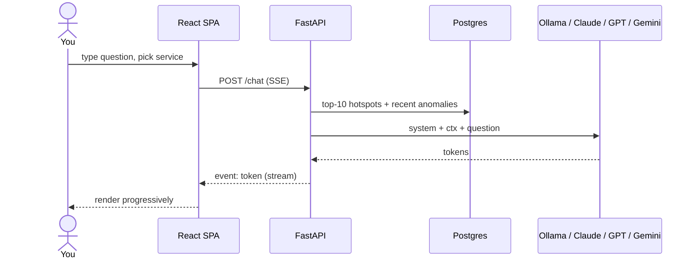

# Tutorial 03 — Chat with profiles

Ask questions in natural language against recent profile + anomaly data.

## What the chat sees

The `/chat` endpoint **prepends a context block** to every prompt:

```
RECENT CPU HOTSPOTS (service, function, total):
- demo-jvm11 | io.netty.channel.nio.NioEventLoop.run      | 9824100000
- demo-jvm11 | com.demo.verticles.BlockingCallVerticle.onEventLoop | 5210000000
- …

ACTIVE ANOMALIES (service, metric, z-score):
- demo-jvm11 | cpu.couchbase | +4.82
- …

Question: <your question>
```

This is what gives the LLM traction. Without the context, it would
hallucinate; with the context, it reasons from data.



## Good questions to try

- *"Which verticle is regressing the fastest on demo-jvm11?"*
- *"Is demo-jvm21 burning more CPU in io.netty than demo-jvm11?"*
- *"Explain the top CPU hotspot in plain English."*
- *"Summarize the anomalies in the last hour."*

## Quality by provider

| provider         | notes                                                  |
|------------------|--------------------------------------------------------|
| Ollama `llama3.2:3b` | fast on CPU; short, decent summaries                 |
| Claude           | best quality; terse and accurate                       |
| GPT              | verbose but reliable                                   |
| Gemini Flash     | fast and cheap; decent for small prompts               |

Switch provider: [`../how-to/switch-llm-provider.md`](../how-to/switch-llm-provider.md).

## Why not full streaming with function-calling?

The BFF streams tokens but uses non-streaming LLM responses internally and
splits by line for progressive render. This keeps all four providers
working with a single code path. Function-calling / tool-use would require
provider-specific branches, which is out-of-scope for a demo.
