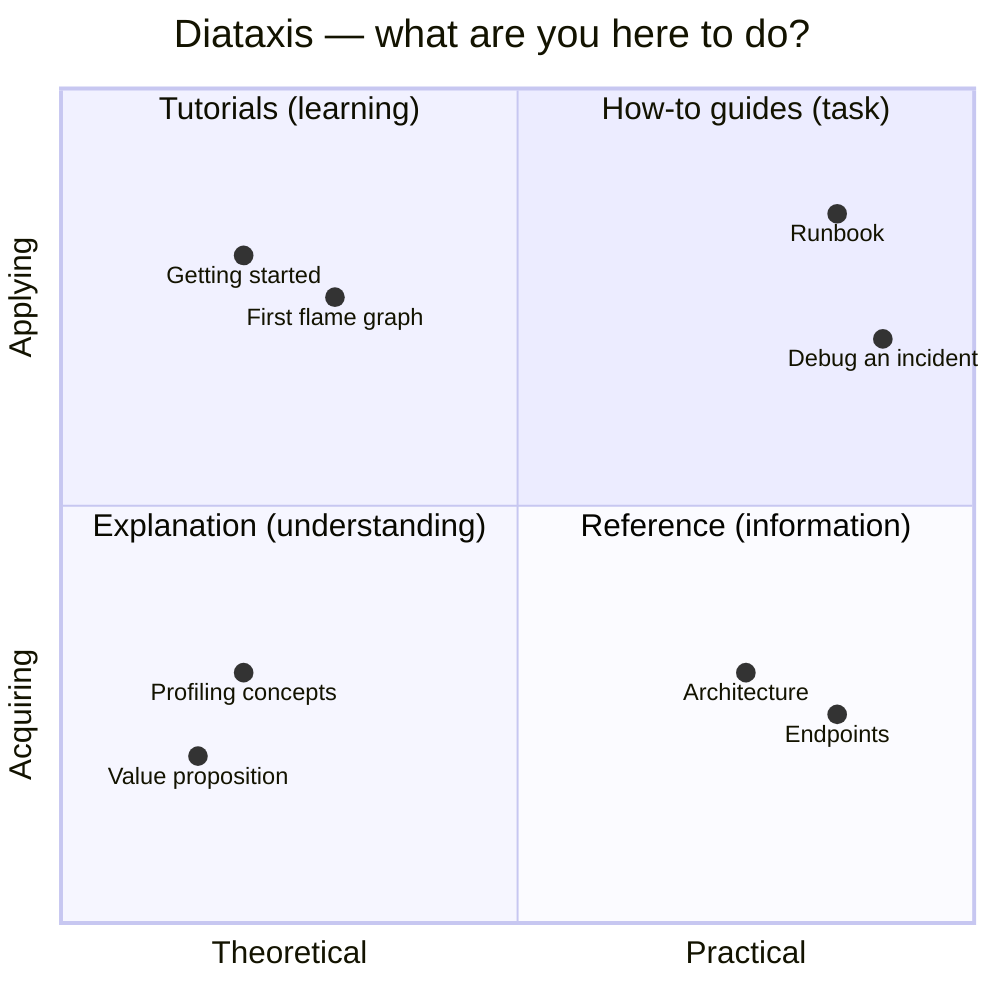

# Documentation

Organised per the [Diataxis](https://diataxis.fr/) framework — four quadrants
that serve four distinct reader intents. Pick the one that matches what
you are trying to do right now.

## Tutorials — learn by doing
- [01 · Getting started](tutorials/01-getting-started.md)
- [02 · Read your first flame graph](tutorials/02-first-flame-graph.md)

## How-to guides — solve a specific problem
- [Runbook: operate the stack](how-to/runbook.md)
- [Debugging incidents with Pyroscope](how-to/debugging-incidents.md)
- [Add a new verticle](how-to/adding-verticle.md)
- [Running on Apple Silicon (M1 / M2 / M3 / M4)](how-to/running-on-apple-silicon.md)
- [Troubleshooting](how-to/troubleshooting.md)

## Reference — look something up
- [Infrastructure & architecture](reference/architecture.md)
- [Endpoints](reference/endpoints.md)
- [Verticles](reference/verticles.md)
- [Configuration](reference/configuration.md)
- [Dashboards](reference/dashboards.md)
- [Ports](reference/ports.md)

## Explanation — understand the *why*
- [Value proposition](explanation/value-proposition.md)
- [Profiling concepts](explanation/profiling-concepts.md)
- [Code walkthrough](explanation/code-walkthrough.md)
- [JVM 11 vs JVM 21](explanation/jvm11-vs-jvm21.md)
