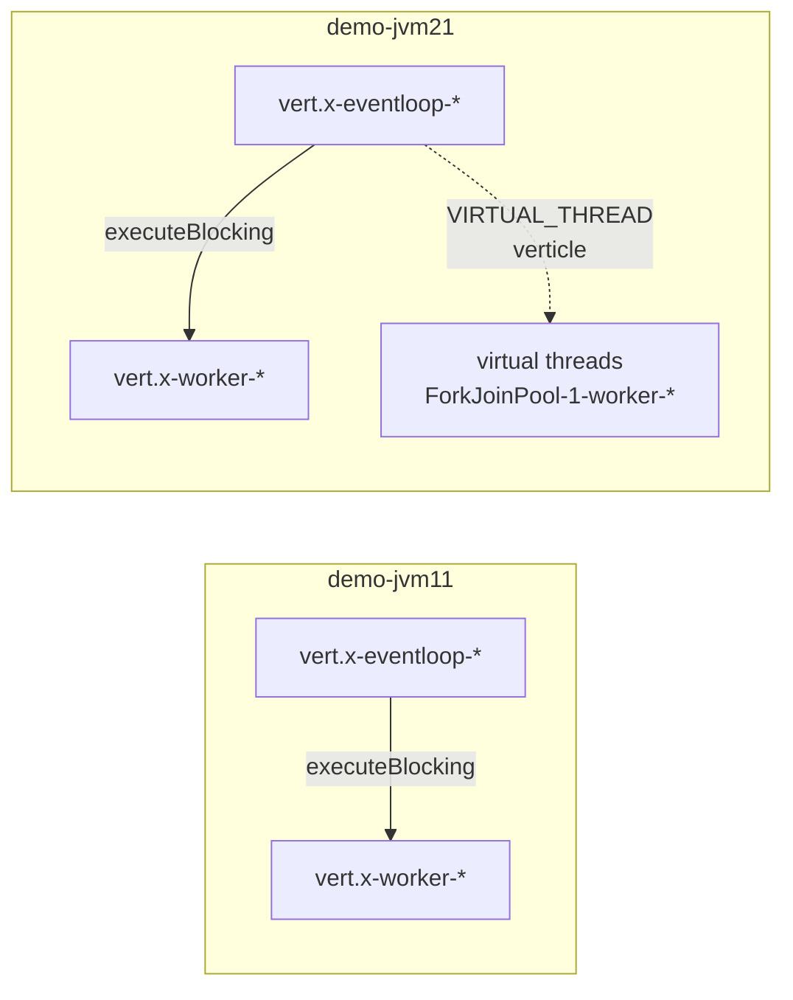

# Explanation — JVM 11 vs JVM 21

Why the demo runs both side by side.

## What changes at the source level

| concern           | jvm11 app                               | jvm21 app                                  |
|-------------------|-----------------------------------------|--------------------------------------------|
| base image        | `eclipse-temurin:11-jre`                | `eclipse-temurin:21-jre`                   |
| Gradle            | 7.6.4 (+ Shadow 7.1.2)                  | 8.7 (+ Shadow 8.1.1)                       |
| `sourceCompatibility` | 11                                   | 21                                         |
| virtual threads   | n/a                                     | `VirtualThreadVerticle` deployed via `ThreadingModel.VIRTUAL_THREAD` |
| Couchbase SDK     | 3.4.11 (last JDK 11-compatible)         | 3.6.2                                      |
| other source      | **identical**                           | **identical**                              |

The identical-source policy is deliberate: any flame-graph difference you
see is attributable to the JVM + virtual-thread verticle, not to code
divergence.

## What changes at runtime

### Thread topology

On JVM 21 you'll see an additional thread group: `ForkJoinPool-1-worker-*`
carrying virtual threads. The Pyroscope agent samples them the same way
as platform threads.

### Loom-specific flame-graph frames

Expect to see, only on jvm21:

- `java.lang.VirtualThread.run`
- `VirtualThread$VThreadContinuation.enter`
- `Continuation.yield` / `Continuation.run` during park/unpark

These are the carrier-thread hand-off points. If they dominate CPU, the
workload is pinning the virtual thread (e.g. synchronised block that
blocks inside a JNI call) — a real perf regression.

### GC defaults

JVM 21 ships with G1 GC and different ergonomics; heap sizing behaves
differently under similar load. Compare `jvm_gc_*` metrics in Prometheus
to see the effect.

## The comparison workflow

Pyroscope's "Comparison" view is the primary way to use this setup:

1. Left: `{service_name="demo-jvm11"}`.
2. Right: `{service_name="demo-jvm21"}`.
3. Same profile type, same time window.
4. Diff flame graph:
   - Red = only/more on the right (jvm21).
   - Green = only/more on the left (jvm11).

Questions you can answer:

- Does virtual-thread code allocate more?
- Does the Couchbase 3.6 client have a different CPU profile?
- Are locks cheaper on jvm21's improved monitor implementation?

## When the comparison is misleading

- **Warmup skew.** JVM 21 may still be C2-compiling while jvm11 is warm;
  wait 2–3 min of load before comparing.
- **Client libs differ.** Couchbase SDK versions differ — a frame present
  on one side only may be the SDK, not the JVM.
- **Workload balance.** k6 / `load.sh` hit both apps evenly; if you
  script unbalanced traffic, the diff will be dominated by traffic ratio,
  not runtime behaviour.
