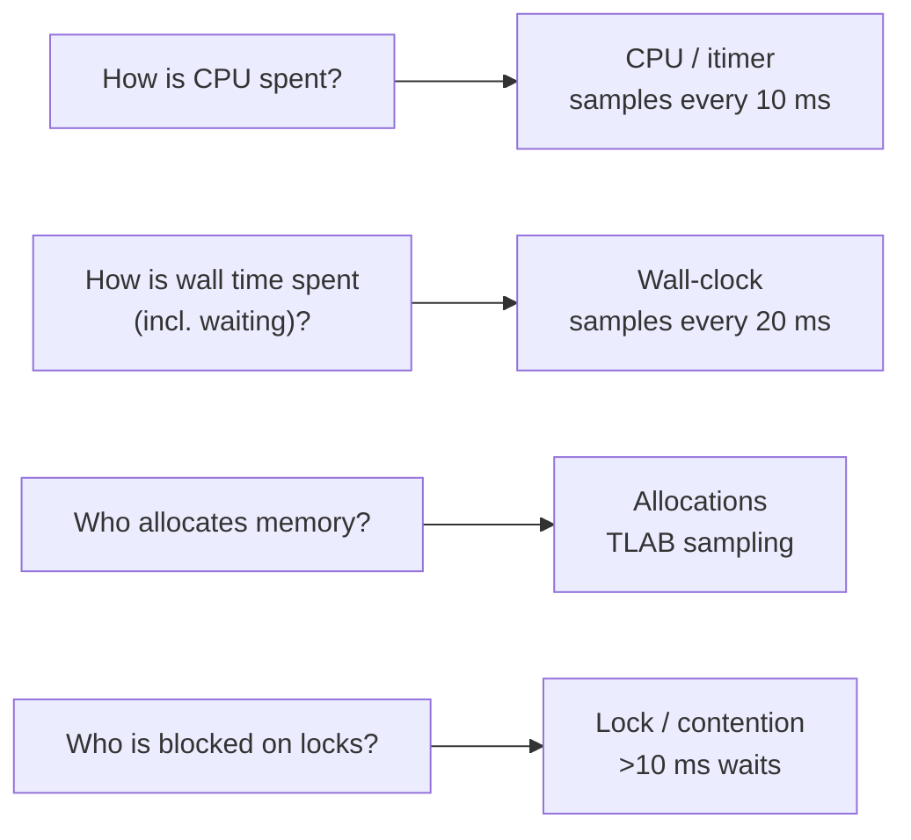
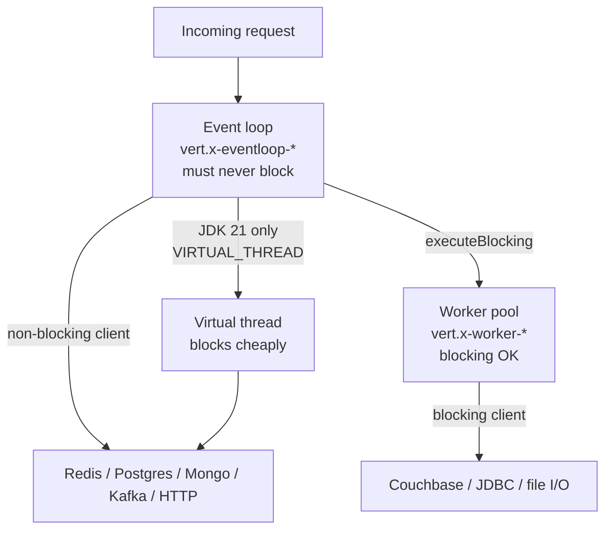
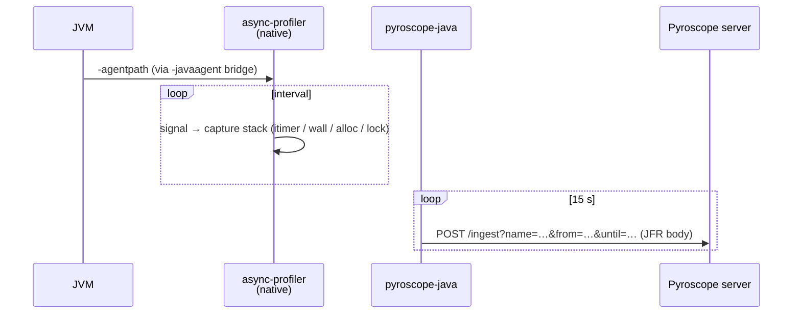

# Explanation — profiling concepts

A short primer on *why* the demo enables the profile types it does and
what each one actually measures. If you only read one explanation doc,
read this one.

## The four profile types, and the questions they answer



### CPU (itimer)

Sampled every 10 ms on currently-executing threads. **Does not sample
waiting threads** — if a thread is blocked on I/O, it contributes zero
CPU samples.

- Wide frames = functions burning cycles.
- Deep stacks = lots of framework overhead on top of your code.
- If CPU is high *and* latency is high, profile here first.

### Wall-clock

Sampled every 20 ms on **all threads, running or not**. This is the
closest profiling gets to answering "where is my time actually going?"

- Event-loop thread with wide `Thread.sleep` / `Socket.read` frames = a
  blocker on the loop (the #1 Vert.x killer).
- Worker thread idle = under-utilised pool.
- CPU-flat + wall-clock-wide = I/O-bound.

### Allocations (TLAB sampling)

Captures a sample when an allocation exceeds the 256 KB threshold. Every
allocation above ~256 KB is recorded; smaller allocations are
probabilistically sampled. Output units are bytes.

- Bigger bars = more heap bytes allocated by that code path.
- Correlates with GC pressure and long pauses.
- Often the biggest hotspots are logging + JSON serialization in hot
  paths.

### Lock (contention)

Records *blocked time* when a thread waits >10 ms to acquire a monitor
or `java.util.concurrent.locks.Lock`.

- Bottom frame: the class of the contested lock.
- Stack: the *blocked* thread's stack (not the holder's).
- To find the holder: read CPU profile for the same window, look for a
  thread executing inside a `synchronized` method on the same object.

## Sampling, not tracing

All four are **statistical**. The agent captures stacks on a timer and
aggregates. This is:

- **Cheap** — fixed ~3–5 % CPU overhead regardless of request volume.
- **Incomplete** — a function that runs rarely may never appear.
- **Not request-scoped** — the flame graph is aggregate across all
  threads and requests in the window.

If you need per-request causality, use distributed tracing (OpenTelemetry)
in addition.

## What labels are for

A raw flame graph shows *all* stacks mixed together. Labels let you
**slice** without re-profiling:

```
service_name="demo-jvm11"           # one app
thread_name=~"vert.x-eventloop-.*"  # one thread group
integration="redis"                  # one integration client
```

The demo uses three label axes:

- `service_name` — set via `PYROSCOPE_APPLICATION_NAME` at JVM start.
- `thread_name` — added automatically by the agent per sample.
- `integration` — set dynamically per call via
  `Pyroscope.LabelsWrapper.run(new LabelsSet("integration", …), …)`.

Keep label cardinality bounded. Do **not** use request IDs, user IDs, or
timestamps as labels — each unique value is a separate time series.

## The Vert.x thread model, in one diagram



Understanding this diagram is 80 % of reading a Vert.x flame graph.

## How the agent works (briefly)



async-profiler uses OS signals (`itimer`) to sample stacks without the
safepoint bias of JVM-only profilers. The result: no blind spots at
synchronised blocks, JNI calls, or Loom virtual threads.
