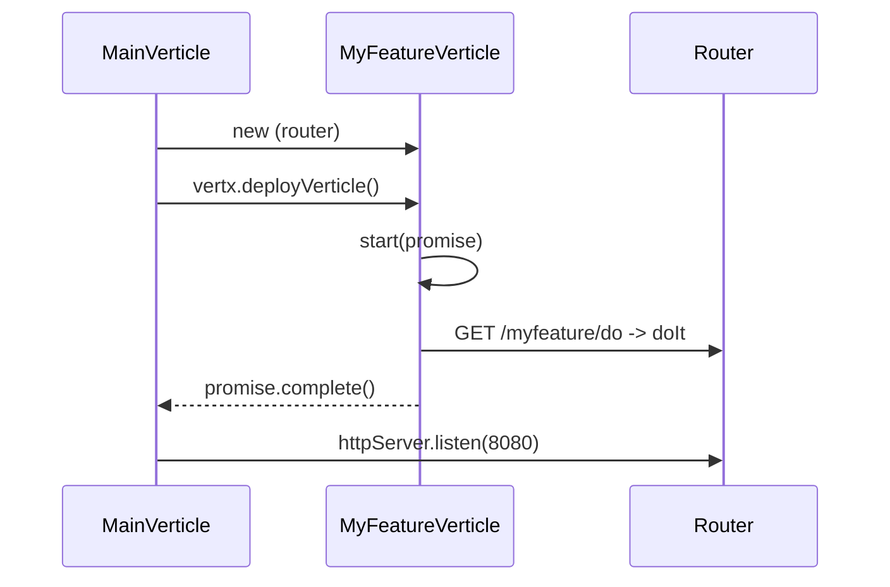

# How-to — add a new verticle

Extend the demo with a new feature verticle. Keep the contract:

1. Extends `AbstractVerticle`.
2. Constructor takes the shared `Router`.
3. Registers its own routes in `start()`.
4. Wraps integration calls in `Label.tag("<name>", …)` so the hotspots
   dashboard filters by integration.
5. Named clearly — class name appears in flame graphs.

## 1. Create the verticle (both apps if it applies to both)

`apps/demo-jvm11/src/main/java/com/demo/verticles/MyFeatureVerticle.java`:

```java
package com.demo.verticles;

import com.demo.Label;
import io.vertx.core.AbstractVerticle;
import io.vertx.core.Promise;
import io.vertx.ext.web.Router;
import io.vertx.ext.web.RoutingContext;

public class MyFeatureVerticle extends AbstractVerticle {
    private final Router router;
    public MyFeatureVerticle(Router router) { this.router = router; }

    @Override public void start(Promise<Void> p) {
        router.get("/myfeature/do").handler(this::doIt);
        p.complete();
    }

    private void doIt(RoutingContext ctx) {
        Label.tag("myfeature", () -> {
            // ... your work
            ctx.json(new io.vertx.core.json.JsonObject().put("ok", true));
        });
    }
}
```

## 2. Register in MainVerticle

`apps/demo-jvm11/src/main/java/com/demo/MainVerticle.java`:

```java
features.add(new MyFeatureVerticle(router));
```

## 3. (Optional) Add a dashboard panel

Edit `config/grafana/dashboards/integration-hotspots.json` — duplicate an
existing panel, change `labelSelector` to
`{service_name="$service", integration="myfeature"}`.

## 4. Rebuild

```bash
docker compose up -d --build demo-jvm11 demo-jvm21
```

Grafana auto-reloads dashboards every 10 s (`updateIntervalSeconds: 10`).

## Lifecycle



## Checklist

- [ ] Class name is meaningful (shows in flame graphs)
- [ ] Routes registered in `start()`, not constructor
- [ ] Integration calls wrapped in `Label.tag`
- [ ] Uses `executeBlocking` if the client is synchronous
- [ ] Added to `MainVerticle.features`
- [ ] Added to `scripts/load.sh` and `config/k6/load.js` for coverage
- [ ] (Optional) Hotspots panel updated
