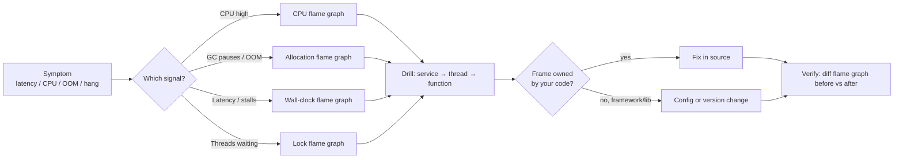

# How-to — debug incidents with Pyroscope

This runbook teaches the debugging *loop*, not a checklist. Each scenario
below maps an observed symptom → a profile view → a likely root cause.
Reproduce each with the demo's intentional faults.

## The general loop



## Scenario 1 — tail latency spikes

**Symptom:** p99 climbs, p50 stays flat. Some requests are slow, most are fine.

**Reproduce:**
```bash
source .env
# hammer the event-loop blocker
while true; do curl -s localhost:$DEMO_JVM11_PORT/blocking/on-eventloop?ms=300 & sleep 0.05; done
```

**Investigate:**
1. Grafana → **Per-Verticle Profile** → `service=demo-jvm11`,
   `thread=vert.x-eventloop-.*`, profile = **Wall Clock**.
2. Look for a wide, deep frame under an event-loop handler. Anything
   showing `Thread.sleep`, `BlockingQueue.take`, `Socket.read`, or
   JDBC/JNDI is a blocker on the event loop.
3. In this demo the culprit is `BlockingCallVerticle.onEventLoop`.

**Fix pattern:** move the blocking call to `executeBlocking` (worker pool)
or, on Java 21, to a virtual-thread verticle
(`ThreadingModel.VIRTUAL_THREAD`).

**Verify:** Pyroscope → Comparison view → before vs after the deploy. The
offending frame should shrink to zero on event-loop threads and reappear
on `vert.x-worker-*`.

## Scenario 2 — thread leak

**Symptom:** JVM thread count grows unboundedly; memory climbs; eventual OOM.

**Reproduce:**
```bash
for _ in {1..10}; do curl -s localhost:$DEMO_JVM11_PORT/leak/start?n=20 > /dev/null; done
```

**Investigate:**
1. Prometheus → query `jvm_threads_live_threads{service="demo-jvm11"}`.
   Growth is a thread leak.
2. Pyroscope → filter `{service_name="demo-jvm11",thread_name=~"demo-leak-.*"}`.
3. Open the **Wall Clock** profile: you will see a mountain of `Object.wait`
   or `Thread.sleep` frames under `ThreadLeakVerticle.leakBody`.

**Fix pattern:** use a bounded executor; tie thread lifecycle to verticle
lifecycle (`stop()` interrupts); prefer `vertx.setTimer` or `executeBlocking`.

## Scenario 3 — GC pressure

**Symptom:** periodic latency hitches every few seconds; GC logs show
frequent allocation failures.

**Investigate:**
1. Grafana → **Demo Overview** → **Allocations** panel.
2. Widest stacks are allocation hotspots. In this demo typical culprits:
   - `JsonObject` / `JsonArray` per request (web handlers).
   - Kafka codec encode/decode.
   - Lambda capture chains in `compose()` pipelines.
3. Cross-check JVM heap metrics in Prometheus.

**Fix pattern:**
- Reuse buffers (Netty `ByteBuf` pooling).
- Batch EventBus messages instead of one-per-item.
- Replace `String.format` in hot paths.

## Scenario 4 — mystery lock contention

**Symptom:** throughput doesn't scale past N concurrent requests; CPU is
low; wall-clock shows threads waiting.

**Investigate:**
1. **Demo Overview** → **Lock Contention** flame graph.
2. Bottom frame names the contested lock class
   (`ReentrantLock`, `ConcurrentHashMap$Node`, a user-defined monitor).
3. The stack above it shows *who* is blocked. To find the *holder*, cross-
   reference the CPU profile over the same interval for a thread executing
   inside a `synchronized` method on the same object.

**Demo reproduction:** hammer Postgres with more concurrent requests than
the pool size (`MaxSize=4`):
```bash
for _ in {1..50}; do curl -s localhost:$DEMO_JVM11_PORT/postgres/query & done
```
Look for contention on `PgPoolImpl`.

**Fix pattern:** raise pool size, reduce time spent holding the connection,
or move to a non-blocking equivalent.

## Scenario 5 — "which verticle is slow?"

**Symptom:** aggregate latency is up; unclear which handler.

**Investigate:**
1. **Integration Hotspots** dashboard — panels are filtered by
   `integration` label (redis/postgres/kafka/…). The biggest panel wins.
2. Drill: click into the dominant integration's flame graph, zoom to the
   verticle, identify the hot function.

## Scenario 6 — JVM 11 vs JVM 21 regression

**Symptom:** one JVM version is slower than the other for the same workload.

**Investigate:** Pyroscope **Comparison** view, side-by-side.
- Left: `{service_name="demo-jvm11"}`.
- Right: `{service_name="demo-jvm21"}`.
- Same profile type, same time window. Red frames = only/more on the right;
  green frames = only/more on the left.

Common finding: on JVM 21 virtual-thread verticles, you'll see
`VirtualThread.park` and carrier-thread mount/unmount overhead — normal if
small, a red flag if wide.

## Decision-tree cheatsheet

| observed                  | best flame graph  | first label filter                         |
|---------------------------|-------------------|--------------------------------------------|
| CPU pinned                | CPU (itimer)      | `service_name`                             |
| Slow, low CPU             | Wall-clock        | `thread_name=~"vert.x-eventloop-.*"`       |
| GC pauses                 | Allocations       | `service_name`                             |
| Throughput plateau        | Lock              | `service_name`                             |
| Scoped to integration     | CPU               | `integration="redis"` (etc.)               |
| Per verticle              | CPU               | frame search by verticle class name        |

## When profiling isn't enough

Pyroscope captures *what code is on-CPU / waiting / allocating*. It does
**not** capture:
- Request-level tracing across services (use OpenTelemetry).
- EventBus message routing (add tracing hooks).
- Network latency between nodes (use tcpdump / eBPF).

If the flame graph is clean but latency is still high, move to distributed
tracing.
