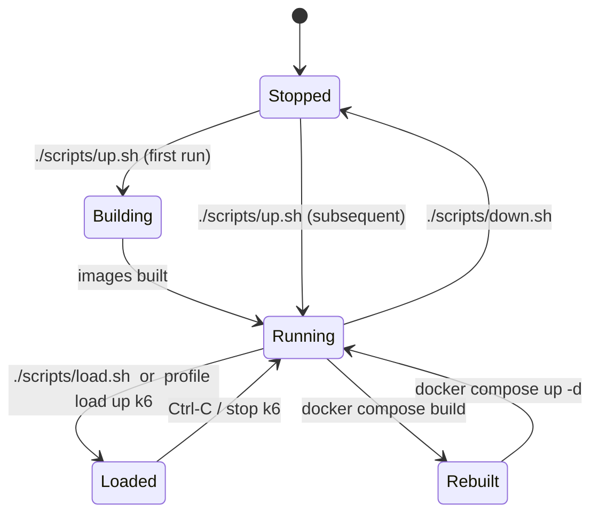

# Runbook — operate the stack

Canonical lifecycle commands. Assume CWD is `local-demo/`.

## Lifecycle



## Start

```bash
./scripts/up.sh                      # auto-wires ports, builds, launches
```

Prints the effective port map; also written to `.env`. Re-runs are idempotent.

## Stop

```bash
./scripts/down.sh                    # containers + volumes (demo only)
docker compose stop                  # keep volumes (faster restart)
```

## Restart one service

```bash
docker compose restart demo-jvm11
docker compose up -d --build demo-jvm21   # rebuild only one
```

## Logs

```bash
docker compose logs -f demo-jvm11 demo-jvm21
docker compose logs --tail=200 pyroscope
docker compose logs couchbase-init      # run-once init job
```

## Load

```bash
./scripts/load.sh                        # curl loop, host-side, Ctrl-C stops
docker compose --profile load up k6      # containerised 10 VUs × 5 min
docker compose --profile load run --rm k6 run --vus 50 --duration 2m /scripts/load.js
```

## Health checks

```bash
source .env
for p in $DEMO_JVM11_PORT $DEMO_JVM21_PORT; do
  echo -n "localhost:$p/health = "; curl -sf localhost:$p/health
done
curl -sf localhost:$PYROSCOPE_PORT/ready
curl -sf localhost:$PROMETHEUS_PORT/-/ready
curl -sf localhost:$GRAFANA_PORT/api/health | jq .
```

## Scaling load

Increase virtual users:

```bash
docker compose --profile load run --rm \
  -e JVM11_URL=http://demo-jvm11:8080 -e JVM21_URL=http://demo-jvm21:8080 \
  k6 run --vus 100 --duration 10m /scripts/load.js
```

## Port conflicts after the fact

Re-run `./scripts/up.sh`. It re-probes, rewrites `.env`, and recreates the
containers. Active sessions on the old port will drop.

## Resetting state

```bash
./scripts/down.sh                        # includes -v, removes volumes
docker compose --profile load down -v    # same
docker system prune -f                   # optional, removes dangling images
```

## Backup / restore Pyroscope data

Pyroscope stores TSDB blocks in the `pyroscope-data` volume. Snapshot:

```bash
docker run --rm -v pyroscope-local-demo_pyroscope-data:/src -v $PWD:/dst alpine \
  tar czf /dst/pyroscope-backup.tar.gz -C /src .
```

## Known quirks

- **Couchbase init** takes 30–60 s; `/couchbase/*` returns 503 until ready.
- **Kafka** advertises `localhost:${KAFKA_PORT}` externally and `kafka:9092`
  internally — clients inside the demo network must use the internal name.
- Pyroscope agent uploads every **15 s**; first flame graph appears ~30 s
  after traffic starts.
