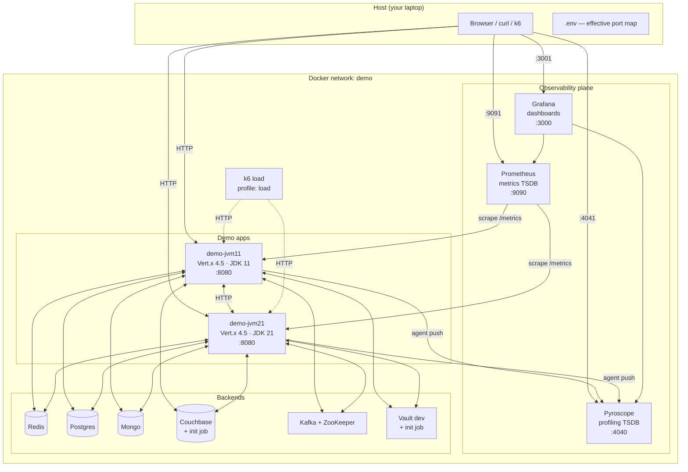
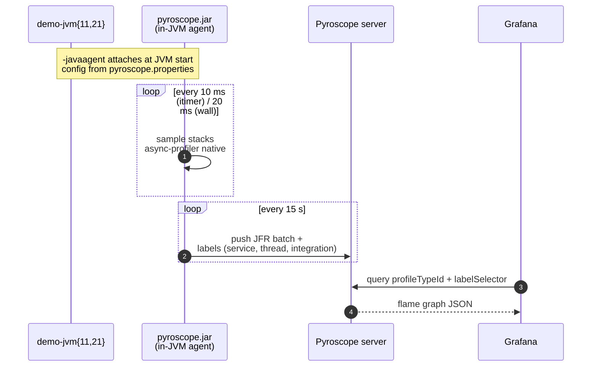
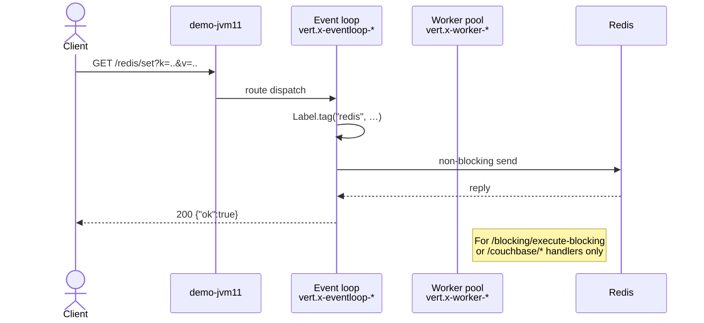

# Reference — infrastructure & architecture

## High-level topology

Legend: solid = request; dashed = load.

## Container inventory

| container               | image                             | role                                       |
|-------------------------|-----------------------------------|--------------------------------------------|
| `demo-pyroscope`        | grafana/pyroscope:1.8.0           | profile ingest + TSDB + query API          |
| `demo-prometheus`       | prom/prometheus:v2.53.0           | metrics scrape + query                     |
| `demo-grafana`          | grafana/grafana:11.5.2            | UI; datasources + dashboards provisioned   |
| `demo-redis`            | redis:7-alpine                    | KV store                                   |
| `demo-postgres`         | postgres:16-alpine                | relational DB (`demo`/`demo`/`demo`)       |
| `demo-mongo`            | mongo:7                           | document DB                                |
| `demo-couchbase`        | couchbase:community-7.2.0         | document DB                                |
| `demo-couchbase-init`   | curlimages/curl:8.5.0             | one-shot bucket setup                      |
| `demo-zookeeper`        | confluentinc/cp-zookeeper:7.6.1   | Kafka coordination                         |
| `demo-kafka`            | confluentinc/cp-kafka:7.6.1       | message bus                                |
| `demo-vault`            | hashicorp/vault:1.17              | secrets (dev mode, root token)             |
| `demo-vault-init`       | hashicorp/vault:1.17              | one-shot kv seeding                        |
| `demo-jvm11`            | built from `./apps/demo-jvm11`    | Java 11 Vert.x app                         |
| `demo-jvm21`            | built from `./apps/demo-jvm21`    | Java 21 Vert.x app                         |
| `demo-k6`               | grafana/k6:0.51.0                 | load generator (profile `load`)            |

## Data flow — profiling

## Data flow — request

## Request paths exercised

| integration | primary thread group                 | client type    | demo route                               |
|-------------|--------------------------------------|----------------|------------------------------------------|
| redis       | vert.x-eventloop-*                    | non-blocking   | `/redis/{set,get}`                       |
| postgres    | vert.x-eventloop-*                    | non-blocking   | `/postgres/query`                        |
| mongo       | vert.x-eventloop-*                    | non-blocking   | `/mongo/{insert,find}`                   |
| couchbase   | vert.x-worker-*                       | **blocking**   | `/couchbase/{upsert,get}`                |
| kafka       | vert.x-eventloop-*                    | non-blocking   | `/kafka/{produce,consume}`               |
| http        | vert.x-eventloop-*                    | non-blocking   | `/http/client`                           |
| vault       | vert.x-eventloop-*                    | non-blocking   | `/vault/read`                            |
| eventbus    | vert.x-eventloop-*                    | non-blocking   | `/f2f/call`                              |
| vt (jvm21)  | virtual                               | Loom           | `/vt/sleep`, `/vt/info`                  |

## Isolation from the main stack

- Compose project name `pyroscope-local-demo` (set via `name:` at the top
  of `docker-compose.yaml`). Volumes and network are namespaced under this
  project; `down.sh` only affects this project.
- Host ports default to a non-overlapping band (see [ports.md](ports.md))
  so the demo can run alongside the repo's main compose stack.
