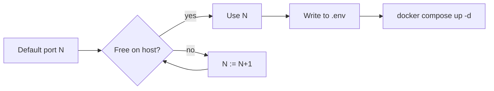

# Reference — ports

All defaults sit in a non-standard band (1xxxx) to avoid collisions with
the main compose stack and the usual suspects.

| service       | host default | in-container | env var               |
|---------------|--------------|--------------|-----------------------|
| Grafana       | 3001         | 3000         | `GRAFANA_PORT`        |
| Pyroscope     | 4041         | 4040         | `PYROSCOPE_PORT`      |
| Prometheus    | 9091         | 9090         | `PROMETHEUS_PORT`     |
| demo-jvm11    | 18080        | 8080         | `DEMO_JVM11_PORT`     |
| demo-jvm21    | 18081        | 8080         | `DEMO_JVM21_PORT`     |
| Redis         | 16379        | 6379         | `REDIS_PORT`          |
| Postgres      | 15432        | 5432         | `POSTGRES_PORT`       |
| Mongo         | 17017        | 27017        | `MONGO_PORT`          |
| Couchbase UI  | 18091        | 8091         | `COUCHBASE_PORT`      |
| Kafka (HOST)  | 19092        | 29092        | `KAFKA_PORT`          |
| Vault         | 18200        | 8200         | `VAULT_PORT`          |

## Autowiring

`scripts/up.sh` probes each default on the host. If a port is in use, it
walks upward until it finds a free one, then writes the effective value
to `.env`. Compose reads `.env` for the host-side port. Internal ports
never change.

## Common collisions

- **3000** — the main repo's Grafana; demo uses 3001 to coexist.
- **4040** — main repo's Pyroscope; demo uses 4041.
- **5432 / 6379 / 27017** — local Postgres/Redis/Mongo daemons on dev
  machines. Demo uses 15432/16379/17017.

## Manual override

Edit `.env` and run `docker compose up -d`. Compose only recreates
containers whose port mapping changed.
