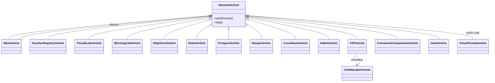
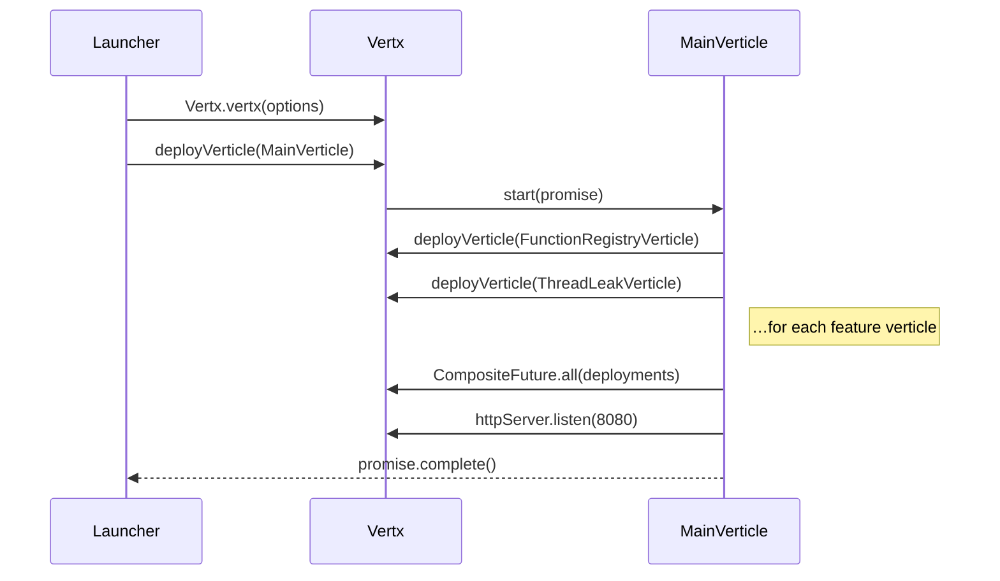

# Reference — verticles

Each verticle is a single feature. Class names appear verbatim in flame
graphs — the first signal in a debugging session is usually "which
verticle is this frame under?".

| class                           | routes                                          | thread group           | integration label |
|---------------------------------|-------------------------------------------------|------------------------|-------------------|
| `MainVerticle`                  | `/health`, `/metrics`, `/functions`             | event loop             | —                 |
| `FunctionRegistryVerticle`      | `/registry`                                     | event loop             | —                 |
| `ThreadLeakVerticle`            | `/leak/*`                                       | spawns platform threads| —                 |
| `BlockingCallVerticle`          | `/blocking/*`                                   | event loop + worker    | —                 |
| `HttpClientVerticle`            | `/http/echo`, `/http/client`                    | event loop             | `http`            |
| `RedisVerticle`                 | `/redis/*`                                      | event loop             | `redis`           |
| `PostgresVerticle`              | `/postgres/query`                               | event loop             | `postgres`        |
| `MongoVerticle`                 | `/mongo/*`                                      | event loop             | `mongo`           |
| `CouchbaseVerticle`             | `/couchbase/*`                                  | worker pool            | `couchbase`       |
| `KafkaVerticle`                 | `/kafka/*`                                      | event loop             | `kafka`           |
| `F2FVerticle` + child           | `/f2f/call`                                     | event loop (both)      | `eventbus`        |
| `FrameworkComponentsVerticle`   | `/framework/*`                                  | event loop             | —                 |
| `VaultVerticle`                 | `/vault/read`                                   | event loop             | `vault`           |
| `VirtualThreadVerticle` (jvm21) | `/vt/sleep`, `/vt/info`                         | **virtual**            | —                 |

## Conventions shared across all verticles

1. Constructor takes the shared `io.vertx.ext.web.Router`.
2. Routes registered inside `start(Promise<Void>)` — never in the constructor.
3. Integration calls wrapped with `com.demo.Label.tag("<name>", …)` which
   invokes `Pyroscope.LabelsWrapper.run(new LabelsSet("integration", …))`.
   The label propagates to every sample the agent takes while the thread
   is inside that lambda.
4. Blocking clients (Couchbase) are dispatched via
   `vertx.executeBlocking(..., false, …)` with `ordered=false`.

## Deployment order

