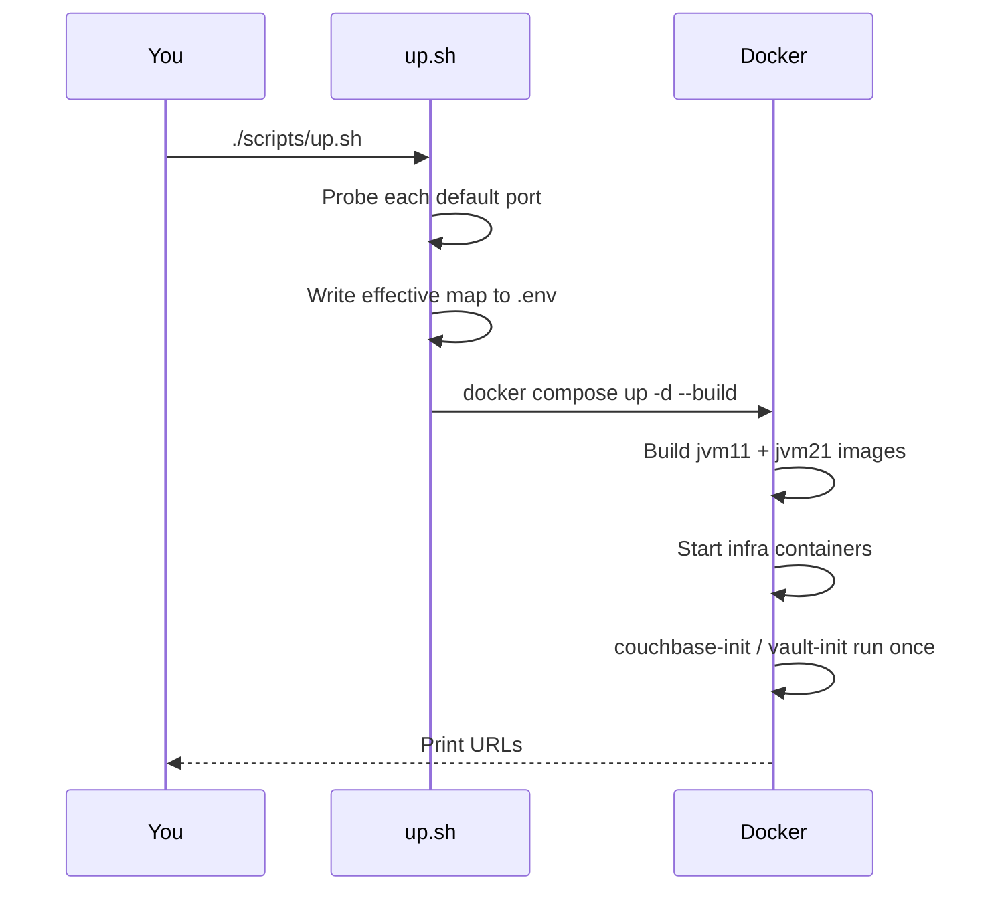

# Tutorial 01 — Getting started

You will spin up the full demo stack, confirm both Vert.x apps are live,
generate traffic, and open your first flame graph in Grafana. Allow ~15
minutes (most of it is the first-time Gradle build).

## Prerequisites

- Docker 24+ with Compose v2 (`docker compose version`)
- ~4 GB free RAM for the stack
- Ports listed in [reference/ports.md](../reference/ports.md) free — the
  launcher auto-bumps conflicts, so this is only a soft requirement

## Step 1 — Launch

```bash
cd local-demo
./scripts/up.sh
```

You should see output like:

```
  [port] GRAFANA_PORT: 3001 busy -> 3002
Effective ports written to .env:
DEMO_JVM11_PORT=18080
...
Grafana:     http://localhost:3002   (admin/admin)
```

Behind the scenes:



## Step 2 — Verify both apps are up

```bash
source .env
curl -s localhost:$DEMO_JVM11_PORT/health
curl -s localhost:$DEMO_JVM21_PORT/health
# {"ok":true}
```

If `/health` hangs for more than 30 s, tail logs:

```bash
docker compose logs -f demo-jvm11 demo-jvm21
```

Wait for `http :8080 ready`.

## Step 3 — Poke one endpoint on each app

```bash
curl -s localhost:$DEMO_JVM11_PORT/redis/set?k=demo\&v=hello
curl -s localhost:$DEMO_JVM11_PORT/redis/get?k=demo
curl -s localhost:$DEMO_JVM21_PORT/vt/info   # shows isVirtual:true
```

## Step 4 — Start continuous load

Open a second terminal:

```bash
./scripts/load.sh
```

This hits every endpoint in a loop. Leave it running.

## Step 5 — Your first flame graph

1. Open `http://localhost:$GRAFANA_PORT` → login `admin` / `admin`
2. Dashboards → **Local Demo** → **Demo Overview**
3. Template variable `service` → pick `demo-jvm11`
4. Wait ~15 s (agent upload interval), refresh. The CPU flame graph should
   populate with frames from `com.demo.verticles.*`

If it stays empty, see [how-to/troubleshooting.md](../how-to/troubleshooting.md).

## Next

- [Tutorial 02 — Read your first flame graph](02-first-flame-graph.md) —
  learn what the colours and widths mean.
- [How-to: debugging incidents](../how-to/debugging-incidents.md) — apply
  the demo to simulated production problems.
