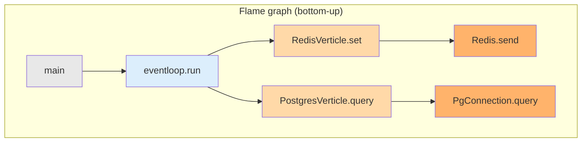

# Tutorial 02 — Read your first flame graph

You have the stack running and load hitting it. Now you will read a flame
graph, compare CPU vs allocation vs lock views, and identify an intentional
antipattern.

## Anatomy of a flame graph

- **Width** = fraction of samples that caller's stack included this frame.
  Wider = more expensive.
- **Depth** = call stack depth; parent → child goes upward.
- **Colour** in Pyroscope is arbitrary (module-hashed) — don't read meaning
  into it.
- Click a frame to zoom. The top bar of the zoom shows what you selected.

## Exercise 1 — spot the event-loop blocker

In Grafana → **Per-Verticle Profile** dashboard:

1. `service = demo-jvm11`, `thread = vert.x-eventloop-.*`
2. Look at the **Wall Clock** flame graph (bottom panel).
3. You should see a wide frame for `BlockingCallVerticle.onEventLoop`
   containing `Thread.sleep`.

That is the demo's intentional antipattern — `/blocking/on-eventloop`
blocks the event-loop thread. In production this would cause tail-latency
spikes across every request sharing that loop.

Now flip the thread filter to `vert.x-worker-.*`. The same `Thread.sleep`
now appears under `BlockingCallVerticle.onWorker` — correctly dispatched
to a worker via `executeBlocking`.

## Exercise 2 — CPU vs allocation vs lock

Open **Demo Overview**. Three panels, same service:

| view          | question it answers                                   |
|---------------|-------------------------------------------------------|
| CPU           | Where are we burning cycles?                          |
| Allocations   | Who's pressuring the GC?                              |
| Lock          | Which threads are blocked waiting for each other?     |

Run `./scripts/load.sh` and watch:
- **Kafka** and **JSON codec** frames dominate allocations.
- **Postgres** connection pool frames may show up in lock contention
  (multiple requests fighting for a pooled connection).
- CPU is usually spread thin across every handler.

## Exercise 3 — compare two services

In the Pyroscope UI (`:$PYROSCOPE_PORT`):

1. "Comparison" view
2. Left: `{service_name="demo-jvm11"}`
3. Right: `{service_name="demo-jvm21"}`
4. Profile type: CPU

The diff flame graph highlights frames that appear in one but not the
other. Virtual-thread carrier frames (`VirtualThread$VThreadContinuation`)
only appear on demo-jvm21.

## Next

- [Debugging incidents](../how-to/debugging-incidents.md) — apply these
  skills to structured scenarios.
- [Explanation: profiling concepts](../explanation/profiling-concepts.md)
  — why CPU sampling, wall-clock, allocation, and lock profiling each
  capture a different slice of reality.
